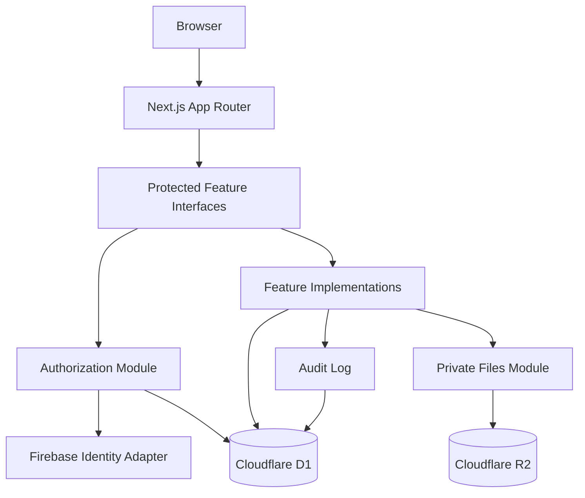

# Unyon Mindanao Portal Implementation Plan

- **Status:** Approved architecture plan
- **Date:** 2026-09-16
- **Requirements:** [SRS.md](./SRS.md)
- **Domain language:** [../../CONTEXT.md](../../CONTEXT.md)

## 1. Delivery Strategy

Build a modular monolith: one Next.js application and one Cloudflare D1 database per environment, organized by product feature. Keep route handlers and Server Actions thin. Each feature exposes a small server interface that hides validation, authorization, atomic D1 batches, auditing, and persistence.

**D1 migration status (2026-09-25):** SQLite/D1 migrations `0001`–`0005`, access/session/bootstrap, invitation, directory, events, communications, evaluations, financial-report, private-file metadata, and audit-history adapters are implemented behind the existing feature interfaces. A `PERSISTENCE_PROVIDER=d1` Worker runtime path is available; PostgreSQL remains the default until environment bindings are deliberately changed. The local-only migration utilities now export an explicit-table PostgreSQL snapshot in a read-only repeatable-read transaction, enforce verified TLS, encrypt the archive with AES-256-GCM, import it only into a newly isolated local D1 persistence directory, reconcile every table count, and intentionally omit `portal_sessions` so users must sign in again. D1 backup snapshots use a separate encryption context/key, preserve all 17 application tables including sessions, and have passed an isolated restore drill with row-content and row-count reconciliation. No Supabase export was run and no remote database was read. All 31 unit-test files (84 tests), lint, strict type checking, and `pnpm deploy:check` pass; the dry run performed no build or deployment. Earlier local proof remains valid: all five D1 migrations applied locally, the Workerd Worker served the app, and 24 desktop/mobile Chromium journeys passed against local D1 and Firebase Auth Emulator. Remaining work before a production cutover: review a real migration archive and data mapping, transfer private-file bytes separately from their D1 metadata, exercise quota/latency budgets, provision and validate remote D1/R2 bindings and protected backup-key storage, implement backup retention/alerts, then perform a separately approved deployment and cutover. Supabase remains unchanged as the rollback source.

The first delivery is a local production-build vertical slice, not a collection of disconnected screens:

1. Super Admin signs in with a verified Firebase account.
2. Super Admin creates a Member University and invites a University Admin.
3. University Admin establishes an Appointment and publishes a University Event.
4. A Representative views the Event.
5. An unauthorized or co-host-only mutation is rejected and audited.

Feature work begins only after this slice proves the Cloudflare runtime.

## 2. System Shape



- **Next.js App Router** renders the UI and supplies route adapters.
- **Feature modules** own complete workflows and are the only entry points for product behavior.
- **Authorization module** converts typed intents into trusted execution contexts.
- **D1/SQLite** owns domain state, authority, constraints, and audit records. Feature adapters use prepared SQL; D1 writes and audit records commit in atomic batches with in-batch authority and optimistic-state checks.
- **Private Files module** owns staged R2 uploads and authorized downloads.
- **Firebase** proves identity and verified email only.

## 3. Planned Repository Layout

```text
src/
├── app/                         # Route adapters, layouts, loading/error UI
│   ├── (auth)/
│   └── (portal)/
├── features/
│   ├── access/                  # Sessions and authorization
│   ├── directory/               # Universities, users, invitations, appointments, birthdays
│   ├── events/                  # Event lifecycle, calendar/list projections, co-hosts
│   ├── evaluations/             # Templates, windows, responses, aggregates, exports
│   ├── communications/          # Announcements and Shortcuts
│   ├── financial-reports/       # Reports and immutable revisions
│   ├── private-files/           # Staged upload/download behavior
│   └── dashboard/               # Cross-feature read projection
├── platform/
│   ├── firebase/                # Production Firebase adapter
│   ├── database/                # D1 bindings, SQL helpers, and migrations
│   ├── r2/                      # Production object-store adapter
│   ├── email/                   # Invitation delivery adapter
│   └── observability/           # Structured logging and correlation IDs
└── shared/
    ├── ui/                      # shadcn/ui primitives and branded composition
    ├── errors/
    ├── validation/
    └── time/
database/d1/
├── migrations/                 # SQLite-compatible D1 schema changes
└── seed/                       # Non-production fixtures/bootstrap data
tests/
├── integration/
├── e2e/
└── fixtures/
docs/
├── adr/
└── unyon/
```

Each feature exposes its external seam from `server/index.ts`. Its implementation, D1 queries, policy details, and adapters remain private. Features may import another feature's public interface, never its internals. Browser modules cannot import `server-only`, database bindings, Firebase administration, or R2 bindings.

## 4. Deep Module Interfaces

### 4.1 Access

Use typed protected-operation factories rather than scattered role checks:

```ts
const publishEvent = authorization.mutation({
  action: "event.publish",
  input: PublishEventInput,
  subject: ({ eventId }) => ({ kind: "Event", eventId }),
  execute: async ({ actor, subject, transaction, occurredAt }, input) => {
    // Event implementation runs only after canonical authorization.
  },
});
```

The factories return callable protected feature functions. Their interface guarantees this ordering:

1. Parse untrusted input.
2. Verify the Firebase session and verified email.
3. Resolve the active Portal User and Appointments using database time.
4. Resolve canonical resource ownership from D1.
5. Evaluate the typed intent with deny-by-default policy.
6. Execute the feature operation.
7. Persist required audit records.
8. Commit and return a stable result.

D1 mutations stage writes and audit records into one atomic `batch()`. Since D1 does not provide an interactive transaction around earlier reads, each protected batch revalidates the session and active Appointment and uses checked conditional mutations for versioned or stateful records. Missing and forbidden scoped resources return the same public error. Raw dependency errors never cross the interface.

Keep feature invariants in their feature: access decides who may act; events decide valid lifecycle transitions; evaluations decide windows and one-response rules.

### 4.2 Sessions

The session interface has three operations:

- `start(idToken, csrfToken)` verifies a recent Firebase sign-in and creates a five-day secure cookie.
- `require()` returns a trusted identity or a stable authentication error.
- `end()` clears the cookie and terminates local state.

Prototype Firebase Admin SDK compatibility on Workers. If it fails, create session cookies through Identity Platform REST and verify their RS256 signatures using cached public keys.

### 4.3 Private Files

The interface is staged because PostgreSQL and R2 cannot share a transaction:

- `reserve(actor, purpose, metadata)` authorizes the domain purpose and creates a pending object record.
- `commit(actor, objectId)` verifies uploaded size, type, signature, and R2 presence before marking it available.
- `authorizeDownload(actor, objectId)` returns a short-lived URL only after authorizing the related Event or Financial Report.

A cleanup job removes expired pending objects. Production uses an R2 adapter; tests use an in-memory adapter.

### 4.4 Feature Interfaces

| Module | External interface responsibilities |
| --- | --- |
| Directory | Manage Member Universities, Invitations, Portal Users, Appointments, birthdays, and deactivation. |
| Events | Search/list/get Events; create drafts; transition lifecycle; manage owner, co-hosts, and cover image. |
| Evaluations | Version templates; manage evaluation windows; submit one response; produce disclosure-safe results and CSV exports. |
| Communications | Publish/archive Announcements and order Shortcuts. |
| Financial Reports | Create report series; stage immutable revisions; publish/supersede; authorize downloads. |
| Dashboard | Return one role-aware dashboard DTO without exposing feature internals. |

Read interfaces return purpose-built DTOs. They never return raw Prisma records or restricted birth years by accident.

## 5. Data Model

| Model | Key rules |
| --- | --- |
| `PortalUser` | Unique Firebase UID and normalized email; active/disabled state; full birth date; optional profile object ID. |
| `MemberUniversity` | Unique name/slug; active/archived state. |
| `Appointment` | Portal User, optional Member University, role, start/end; historical rows remain immutable except ending. |
| `Invitation` | Hashed token, normalized email, role, university, inviter, expiry, accepted/revoked timestamps. |
| `Event` | Confederation or university ownership; lifecycle state; UTC dates; location; optimistic version. |
| `EventCoHost` | Unique Event/Member University pair; grants attribution, not edit authority. |
| `EvaluationTemplateVersion` | Immutable version with ordered rating/comment questions. |
| `EventEvaluationWindow` | Event, template version, open/close timestamps, state. |
| `EvaluationResponse` | Unique Event/Portal User pair; submitted/updated timestamps. |
| `EvaluationAnswer` | Typed answer linked to the snapshotted question. |
| `Announcement` | Draft/published/archived state and publication metadata. |
| `Shortcut` | Label, URL, icon, sort order, active state. |
| `FinancialReport` | Stable report identity and reporting period. |
| `FinancialReportRevision` | Immutable version, object ID, publisher, published/superseded timestamps. |
| `StoredObject` | Purpose, private key, type, size, hash, pending/available/failed state. |
| `AuditLog` | Append-only actor, action, resource, redacted metadata, correlation ID, timestamp. |

Add SQLite constraints, indexes, and triggers for valid owner combinations, non-overlapping active Appointments, unique evaluation responses, revision numbers, append-only audit records, and allowed lifecycle values. Use versioned D1 SQL migrations as the sole target schema source.

## 6. Critical Workflows

### Invitation

1. Authorized administrator creates an Invitation.
2. Email delivery sends the one-time link; the raw token is never stored.
3. Recipient creates and verifies a Firebase email/password account.
4. Acceptance matches normalized verified email, validates expiry, creates the Portal User if needed, and creates the Appointment transactionally.
5. Firebase accounts without an active Appointment remain unable to enter the portal.

### Event publication

1. Feature parses event input.
2. Authorization resolves actor and canonical Owning University.
3. Events module validates transition, dates, owner, and co-hosts.
4. The transaction updates the Event and appends an audit record.
5. Cache/revalidation happens only after commit.

### Financial Report upload

1. Super Admin creates a draft revision and reserves an R2 object.
2. Browser uploads to the signed private destination.
3. Private Files verifies metadata and marks the object available.
4. Publishing makes the revision immutable and supersedes the prior revision transactionally.
5. Downloads authorize the report record before issuing a short-lived URL.

### Event Evaluation

1. Event completion opens the assigned seven-day window.
2. Authorization verifies an active Appointment at Event end.
3. Evaluations enforces state, time, template snapshot, and one-response uniqueness.
4. Super Admin receives attributable results; Owning University Admin receives aggregates only after five responses.
5. Exports use the same disclosure rule as on-screen results.

## 7. Implementation Phases

### Phase 0 — Local runtime proof

- Scaffold Next.js, strict TypeScript, Tailwind, shadcn/ui, Vinext, Wrangler, D1 migrations, and test tooling.
- Configure local, preview, and production environment validation.
- Prove locally in the Workers runtime that session creation/verification, D1 atomic mutation/audit, one private R2 upload/download, and one allow/deny authorization case work. Do not deploy production during this phase.
- Measure CPU time and bundle compatibility.

**Exit:** the local Workers-runtime infrastructure proof passes. No remote deployment occurs before the full MVP is ready for review. Use OpenNext if Vinext fails a required capability; use Identity Platform REST/JWT verification if Firebase Admin fails.

### Phase 1 — Access and directory

- Complete the D1 schema/migrations, audit model, bootstrap command, and seed data; keep Supabase unchanged as rollback until data migration and restore are verified.
- Implement sessions, protected-operation factories, permission matrix, Invitations, Appointments, Member Universities, profiles, and birthdays.
- Add Super Admin bootstrap and account deactivation/session revocation.
- Test role, university scope, historical Appointment, and birth-year scenarios.

**Exit:** an invited user can establish the correct role-scoped session, and every unauthorized matrix case fails closed.

### Phase 2 — Events vertical slice

- Implement Event model, lifecycle, owner/co-host rules, list, detail, and calendar views.
- Implement cover-image staging in R2.
- Apply responsive branded layouts.
- Complete the first end-to-end Super Admin → University Admin → Representative journey.

**Exit:** the accepted vertical-slice journey passes locally, in preview, and on Cloudflare.

### Phase 3 — Portal content

- Add dashboard projection, Announcements, Shortcuts, birthday calendar, and Financial Report revisions.
- Add role-aware administration screens and authorized CSV/file downloads.
- Add archival/restoration flows and audit views.

**Exit:** all non-evaluation MVP publishing workflows satisfy the SRS.

### Phase 4 — Evaluations

- Implement template versioning, event snapshots, windows, responses, aggregation threshold, comments, and exports.
- Add concurrency tests for duplicate responses and closing-window races.
- Verify attributable versus anonymized disclosure.

**Exit:** evaluation acceptance criteria and privacy tests pass.

### Phase 5 — Pilot hardening

- Add encrypted daily backups, retention cleanup, quota checks, health checks, and maintenance-email alerts.
- Run a restore drill and document recovery.
- Complete accessibility, cross-browser, security, and free-tier load checks.
- Review retention assumptions and pilot limitations with Confederation stakeholders.

**Exit:** all SRS acceptance criteria pass and the recovery procedure has been exercised.

## 8. Verification Strategy

- **Module tests:** exercise exported feature interfaces; assert outcomes, stable errors, and audit effects.
- **Policy tests:** table-drive every role, Appointment state, owner/co-host relationship, and sensitive disclosure.
- **Integration tests:** run feature interfaces and D1 migrations against a local Worker-compatible D1 database; verify D1 batches, constraints, and rollback behavior.
- **Adapter contract tests:** run Firebase emulator and in-memory R2 adapters against the same behavioral contract expected from production adapters.
- **End-to-end tests:** use Playwright for sign-in, Invitations, Event publication, evaluations, reports, and deactivation.
- **Accessibility tests:** automate axe checks and manually verify keyboard/focus behavior.
- **Deployment tests:** run the production Vinext build and a Workers-runtime preview in CI.

The interface is the test surface. Tests should survive implementation refactors and should not reach into feature internals.

## 9. Planned Commands

```sh
pnpm dev                 # Next.js development
pnpm dev:worker          # Workers-compatible local runtime
pnpm build               # Production application build
pnpm preview             # Preview the Worker build
pnpm lint                # ESLint
pnpm typecheck           # Strict TypeScript
pnpm test                # Module tests
pnpm test:integration    # Local D1-backed integration tests
pnpm test:e2e            # Playwright journeys
pnpm db:migrate          # Apply local D1 migrations
pnpm backup              # Encrypted D1 export to R2
pnpm restore:verify      # Restore drill against a temporary database
```

Create these scripts during Phase 0; until then, they are planned interfaces rather than executable repository commands.

## 10. Operations and Risk Controls

| Risk | Control and trigger |
| --- | --- |
| Vinext beta incompatibility | Phase 0 feature proof; switch to OpenNext before feature development. |
| Firebase Admin incompatibility on Workers | Use Identity Platform REST for session creation and standards-based JWT verification. |
| Workers Free 10 ms CPU limit | Measure deployed requests; optimize rendering/queries or approve paid Workers before launch. |
| D1 quotas, storage, and request limits | Measure representative queries and storage; alert before quota exhaustion, then optimize, archive by approved policy, or approve an upgrade. |
| D1 and R2 non-atomic writes | Pending/available/failed object states and compensating cleanup. |
| No MVP MFA | Verified email, recent-password checks for sensitive actions, five-day cookies, TOTP roadmap. |
| Free-tier data loss exposure | Daily encrypted backups, seven daily/four weekly retention, quarterly restore test. |
| Authorization drift | Typed intents, protected-operation factories, private D1 imports, and exhaustive policy tests. |

## 11. Architecture Completion Criteria

Architecture implementation is complete when:

- Every browser-triggered behavior enters through a feature interface.
- Routes contain no role matrices, Prisma calls, Firebase administration, or raw R2 keys.
- Every protected operation uses a typed authorization intent.
- D1 constraints and checked batch mutations defend critical invariants independently of UI checks.
- Restricted reads return purpose-specific DTOs and create required audit records.
- External dependencies have production and test adapters only where behavior genuinely varies.
- The vertical slice and all SRS acceptance criteria pass in the Workers runtime.
